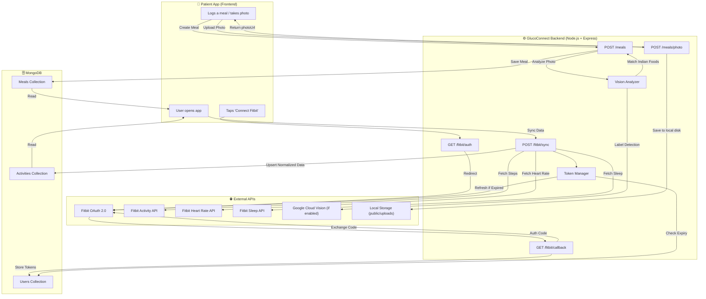

# GlucoConnect Backend

A robust Node.js backend API for health and nutrition tracking. Integrates with the **Fitbit Web API** for activity data synchronization and the **Google Cloud Vision API** for automatic meal photo analysis.

---

## Table of Contents

- [Tech Stack](#tech-stack)
- [Project Structure](#project-structure)
- [Setup Guide](#setup-guide)
  - [1. Prerequisites](#1-prerequisites)
  - [2. Clone & Install](#2-clone--install)
  - [3. Configure Environment Variables](#3-configure-environment-variables)
  - [4. Register a Fitbit Developer Application](#4-register-a-fitbit-developer-application)
  - [5. Configure Google Cloud Vision API](#5-configure-google-cloud-vision-api)
  - [6. Configure Cloud Storage (S3 / R2)](#6-configure-cloud-storage-s3--r2)
  - [7. Run the Server](#7-run-the-server)
- [API Endpoints](#api-endpoints)
- [Data Flow Diagram](#data-flow-diagram)
- [Fitbit Data Mapping](#fitbit-data-mapping)
- [Error Handling](#error-handling)

---

## Tech Stack

| Layer           | Technology                          |
| --------------- | ----------------------------------- |
| Runtime         | Node.js                             |
| Framework       | Express.js 5                        |
| Database        | MongoDB Atlas (M0 Free Tier) via Mongoose |
| Authentication  | JWT (JSON Web Tokens)               |
| File Storage    | Local Disk (`public/uploads`) via Multer |
| External APIs   | Fitbit Web API, Google Cloud Vision |
| HTTP Client     | Axios                               |

---

## Project Structure

```
glucoconnect-backend/
├── app.js                          # Express app setup, middleware, DB connect
├── .env                            # Environment variables (DO NOT COMMIT)
├── .env.example                    # Template for contributors
├── package.json                    # Dependencies and scripts
│
├── config/
│   └── db.js                       # Mongoose connection utility
│
├── models/
│   ├── User.js                     # Patient + Fitbit OAuth tokens
│   ├── Activity.js                 # Normalized daily health data
│   └── Meal.js                     # Meal entries + Vision API labels
│
├── middleware/
│   └── auth.js                     # JWT authentication middleware
│
├── utils/
│   ├── fitbitTokenManager.js       # Auto-refresh expired Fitbit tokens
│   ├── localUpload.js              # Multer local disk storage config
│   ├── localLocator.js             # Zero-cost Haversine distance engine
│   ├── glycemicCalculator.js       # Meal carb load & GI calculator
│   └── visionApi.js                # Vision API + Indian food matching
│
├── providers/
│   ├── WearableProvider.js         # Abstract base provider class
│   ├── FitbitProvider.js           # Fitbit implementation
│   └── providerRegistry.js         # Dynamic provider lookup
│
├── data/
│   ├── healthyRestaurants.json     # Static zero-cost location data
│   └── indianFoodsSeed.json        # Predefined nutritional data
│
├── scripts/
│   └── seedFoods.js                # DB seeder for foods
│
├── routes/
│   ├── fitbit.js                   # OAuth 2.0 + data sync endpoints
│   └── meals.js                    # Meal CRUD + photo upload
│
├── docs/
│   └── fitbit-mapping.json         # Raw Fitbit → MongoDB field mapping
│
└── README.md                       # This file
```

---

## Setup Guide

### 1. Prerequisites

- **Node.js** v18+ — [Download](https://nodejs.org/)
- **MongoDB** — Local install or [MongoDB Atlas](https://www.mongodb.com/atlas) (free tier)
- **Fitbit Developer Account** — [dev.fitbit.com](https://dev.fitbit.com/)
- **Google Cloud Account** — [console.cloud.google.com](https://console.cloud.google.com/) (For Vision API - Optional, 1,000 free requests/month)

### 2. Database Setup (MongoDB Atlas Free Tier)

Setting up MongoDB Atlas is the fastest way to get your database live for free without taking up any local machine resources.

1. **Create a Free Cluster:**
   - Go to [mongodb.com/atlas](https://www.mongodb.com/cloud/atlas) and register.
   - Click **Create** and choose the **M0 Free** cluster tier (512MB storage).
   - Pick any cloud provider and a region close to you, then click **Create Deployment**.

2. **Configure Security Access:**
   - Under **Security -> Database Access**, create a new user with a password (e.g., `dbUser`).
   - Under **Security -> Network Access**, click **Add IP Address** and choose **Allow Access From Anywhere** (`0.0.0.0/0`) for development.

3. **Get Your Connection String:**
   - Navigate to the **Database** tab and click **Connect**.
   - Select **Drivers** and copy the connection string.

### 3. Clone & Install

```bash
git clone <your-repo-url>
cd glucoconnect-backend
npm install
```

### 4. Configure Environment Variables

```bash
cp .env.example .env
```

Edit `.env` and fill in all values. Ensure you update the `MONGO_URI` with the connection string from Atlas, inserting your database name (`glucoconnect`) before the query parameters:
```env
MONGO_URI=mongodb+srv://<username>:<password>@cluster0.xxxx.mongodb.net/glucoconnect?retryWrites=true&w=majority&appName=Cluster0
```

**Generate a JWT secret:**

```bash
node -e "console.log(require('crypto').randomBytes(64).toString('hex'))"
```

### 5. Register a Fitbit Developer Application

1. Go to [dev.fitbit.com/apps](https://dev.fitbit.com/apps) and log in.
2. Click **Register a New App**.
3. Fill in the form:
   | Field | Value |
   | ----- | ----- |
   | Application Name | GlucoConnect |
   | Description | Health tracking backend |
   | Application Website | http://localhost:3000 |
   | Organization | Your name |
   | Organization Website | http://localhost:3000 |
   | OAuth 2.0 Application Type | **Personal** |
   | Callback URL | `http://localhost:3000/fitbit/callback` |
   | Default Access Type | Read Only |

4. After creation, copy:
   - **OAuth 2.0 Client ID** → `FITBIT_CLIENT_ID`
   - **Client Secret** → `FITBIT_CLIENT_SECRET`

> **Important:** The Callback URL must exactly match the `FITBIT_REDIRECT_URI` in your `.env`.

### 6. Configure Google Cloud Vision API

1. Go to [Google Cloud Console](https://console.cloud.google.com/).
2. Create a new project (or use existing).
3. **Enable the Vision API**: APIs & Services → Library → Search "Cloud Vision API" → Enable.
4. **Create a service account**: IAM & Admin → Service Accounts → Create.
5. **Download the JSON key**: Click the service account → Keys → Add Key → JSON.
6. Save the JSON file in your project (e.g., `./gcp-key.json`).
7. Set `GOOGLE_APPLICATION_CREDENTIALS=./gcp-key.json` in `.env`.

> **Warning:** Never commit the GCP key file to Git. Add it to `.gitignore`.

### 7. Local Storage Setup

This project uses **100% free local storage**.
1. Create a `public/uploads` directory in the root of your project:
   ```bash
   mkdir -p public/uploads
   ```
2. Photos uploaded via `POST /meals/photo` will be saved here and served statically.

> **Note on Free Hosting:** If you deploy this backend to ephemeral services like Heroku or Render's free tier, uploaded images will be lost whenever the server restarts.

### 8. Database Seeding

To enable the glycemic-aware meal tagging system, you must seed the local Food collection:

```bash
npm run seed:foods
```
This will insert ~30 standard Indian foods with their Glycemic Index and carb values.

### 9. Run the Server

```bash
# Development (auto-restart on file changes)
npm run dev

# Production
npm start
```

You should see:

```
✅ MongoDB connected: localhost
🚀 GlucoConnect Backend running on http://localhost:3000
```

---

## API Endpoints

### Authentication (Development)

| Method | Endpoint | Auth | Description |
| ------ | -------- | ---- | ----------- |
| `POST` | `/auth/dev-token` | ✗ | Generate a JWT for testing. Send `{ "email": "..." }` in body. |

### Fitbit OAuth 2.0

| Method | Endpoint | Auth | Description |
| ------ | -------- | ---- | ----------- |
| `GET` | `/fitbit/auth` | ✗ | Redirects to Fitbit login/authorization page. |
| `GET` | `/fitbit/callback` | ✗ | Handles Fitbit redirect; exchanges code for tokens. |
| `POST` | `/fitbit/sync` | ✓ | Syncs today's steps, heart rate, and sleep from Fitbit. |

### Meals

| Method | Endpoint | Auth | Description |
| ------ | -------- | ---- | ----------- |
| `POST` | `/meals/photo` | ✓ | Upload a meal photo to local disk (multipart, max 5MB). Returns `photoUrl`. |
| `POST` | `/meals` | ✓ | Create a meal entry. Pass `foodIds` array for glycemic metrics. Auto-analyzes photo with Vision API. |
| `GET` | `/meals` | ✓ | List meals with populated food data. Filter: `?startDate=YYYY-MM-DD&endDate=YYYY-MM-DD` |

### Locations (Zero-Cost Engine)

| Method | Endpoint | Auth | Description |
| ------ | -------- | ---- | ----------- |
| `GET` | `/locations/healthy-options` | ✓ | Find top 5 closest healthy restaurants using static fallback engine. Query params: `lat`, `lng`. |

### Quick Test Flow

```bash
# 1. Generate a dev token
curl -X POST http://localhost:3000/auth/dev-token \
  -H "Content-Type: application/json" \
  -d '{"email": "test@example.com"}'

# 2. Use the returned token for authenticated requests
TOKEN="<paste_token_here>"

# 3. Log a meal
curl -X POST http://localhost:3000/meals \
  -H "Authorization: Bearer $TOKEN" \
  -H "Content-Type: application/json" \
  -d '{
    "description": "Dal makhani with roti",
    "mealType": "lunch",
    "timestamp": "2026-06-01T12:30:00Z"
  }'

# 4. List meals
curl http://localhost:3000/meals \
  -H "Authorization: Bearer $TOKEN"
```

---

## Data Flow Diagram



---

## Fitbit Data Mapping

The raw Fitbit API responses are normalized before storage. Below is a summary — see [`docs/fitbit-mapping.json`](docs/fitbit-mapping.json) for the complete mapping with example responses.

### Steps

| Fitbit Raw Field | MongoDB Activity Field |
| ---------------- | ---------------------- |
| `summary.steps` | `steps` |

### Heart Rate

| Fitbit Raw Field | MongoDB Activity Field |
| ---------------- | ---------------------- |
| `activities-heart[0].value.restingHeartRate` | `heartRate.restingHR` |
| `activities-heart[0].value.heartRateZones[].name` | `heartRate.zones[].name` |
| `activities-heart[0].value.heartRateZones[].minutes` | `heartRate.zones[].minutes` |
| `activities-heart[0].value.heartRateZones[].min` | `heartRate.zones[].min` |
| `activities-heart[0].value.heartRateZones[].max` | `heartRate.zones[].max` |

### Sleep

| Fitbit Raw Field | MongoDB Activity Field |
| ---------------- | ---------------------- |
| `summary.totalMinutesAsleep` | `sleep.totalMinutes` |
| `sleep[0].efficiency` | `sleep.efficiency` |
| `summary.stages.deep` | `sleep.stages.deep` |
| `summary.stages.light` | `sleep.stages.light` |
| `summary.stages.rem` | `sleep.stages.rem` |
| `summary.stages.wake` | `sleep.stages.wake` |

---

## Error Handling

| Scenario | HTTP Status | Response |
| -------- | ----------- | -------- |
| Missing/invalid JWT | 401 | `{ "error": "Authentication required..." }` |
| Expired JWT | 401 | `{ "error": "Token expired..." }` |
| Invalid meal type | 400 | `{ "error": "Validation failed.", "details": [...] }` |
| File too large (>5MB) | 400 | `{ "error": "File too large..." }` |
| Invalid file type | 400 | `{ "error": "Invalid file type..." }` |
| Fitbit rate limit (429) | 429 | `{ "error": "Fitbit rate limit reached...", "retryAfterSeconds": N }` |
| Fitbit token revoked | 401 | `{ "error": "Fitbit authorization has been revoked..." }` |
| Vision API timeout | — | Meal is created with `requiresManualTagging: true` |
| Vision API failure | — | Meal is created with `requiresManualTagging: true` |
| MongoDB validation | 400 | `{ "error": "Validation failed.", "details": [...] }` |

---

## License

ISC
